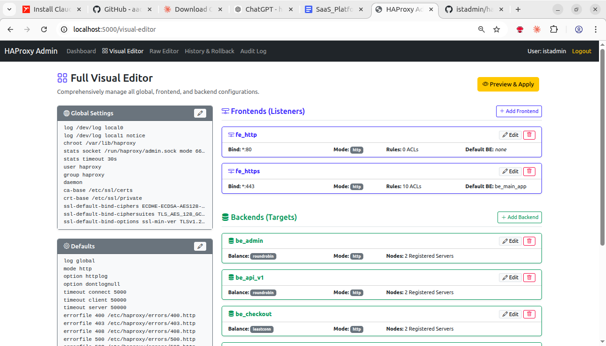
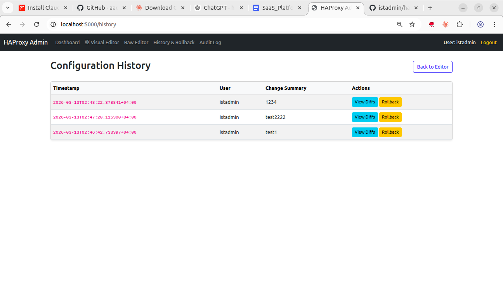
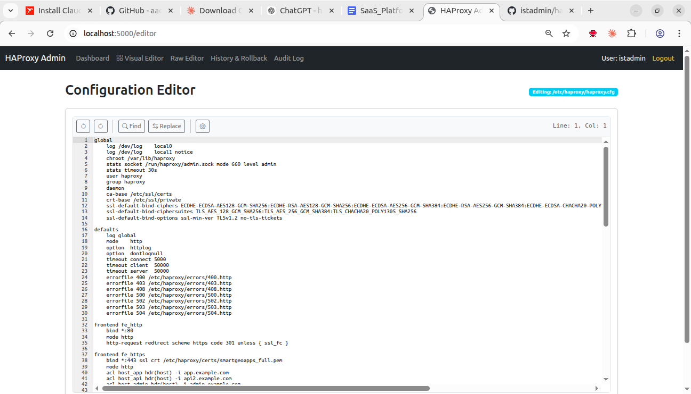

# HAProxy Admin Panel

A secure, internal web application to manage an HAProxy instance.
Built with Python Flask, Jinja2, and Bootstrap 5.





**Supported Versions:** Fully tested and supported with **HAProxy 2.8**.

## Core Features
1. **Visual Editor:** A fully UI-driven experience to easily Create, Read, Update, and Delete HAProxy configurations (Global, Defaults, Frontends, Backends, ACLs, and Routing Rules) without touching raw text.
2. **Raw Editor:** A syntax-highlighted code editor (Ace Editor) to make advanced manual modifications to your `haproxy.cfg`.
3. **Safe Validation:** Never break your live site. Automatically runs `haproxy -c` for syntax validation before any config is applied.
4. **Configuration History:** Automatically backups your configurations to disk on every change. 1-click rollback support.
5. **OS-Level Auth:** Zero database required. Authenticates natively against Linux OS credentials via PAM.
6. **Audit Logs:** Full tracking of who changed what, and from which IP address.

## Prerequisites
To deploy this application, your target server must meet the following requirements:
* **OS:** Ubuntu/Debian (or compatible Linux distribution)
* **Web Server:** Nginx (for Reverse Proxy)
* **Application:** HAProxy 2.8+ installed and running
* **Python:** Python 3.8+ with `pip` and `venv`
* **Access:** Root privileges (`sudo`) are required for the initial installation.

---

## 🚀 1-Click Production Installation (Recommended)

The easiest and safest way to deploy this application to a production server is using the included installer script. This fully automates installing dependencies, setting up the Python virtual environment, configuring specific passwordless `sudo` rights for HAProxy commands, and generating a systemd background service.

1. SSH into your HAProxy server.
2. Clone or place this repository on the server.
3. Switch into the directory:
   ```bash
   cd /path/to/haproxyadmin
   ```
4. Run the installer script as root:
   ```bash
   sudo ./install.sh
   ```

**What the installer does:**
* Installs required apt packages (`python3`, `nginx`, `libpam-dev`, etc.).
* Moves the app to `/opt/haproxy-admin`.
* Installs dependencies via `pip` in an isolated virtual environment.
* Configures `/etc/sudoers.d/haproxy-admin` so the web user can validate and reload HAProxy securely *without* needing a password.
* Configures and starts a `systemd` service (`haproxy-admin`) running via `gunicorn`.
* Configures Nginx to proxy traffic to the web application over port 80.

You can now access the admin panel by visiting your server's IP address or Domain Name in your web browser.

---

## Manual Installation (Development / Custom Deployment)

If you prefer to set up the application manually or are running it locally for development, follow these steps:

### 1. Install System Dependencies
```bash
sudo apt update
sudo apt install python3 python3-pip python3-venv libpam-dev haproxy nginx
```

### 2. Application Setup
```bash
sudo mkdir -p /opt/haproxy-admin
sudo chown -R myadminuser:myadminuser /opt/haproxy-admin
cd /opt/haproxy-admin

# Clone or copy application files into this directory

# Setup Virtual Environment
python3 -m venv venv
source venv/bin/activate
pip install -r requirements.txt
```

### 3. Sudoers Configuration (Critical)
The application runs as a standard user but requires elevated privileges to validate and reload HAProxy. Create a file `/etc/sudoers.d/haproxy-admin`:
```bash
sudo visudo -f /etc/sudoers.d/haproxy-admin
```
Add the following rules tailored to your application user (e.g., `myadminuser`):
```text
myadminuser ALL=(ALL) NOPASSWD: /usr/sbin/haproxy -c -f *
myadminuser ALL=(ALL) NOPASSWD: /bin/systemctl reload haproxy
myadminuser ALL=(ALL) NOPASSWD: /bin/cp /opt/haproxy-admin/tmp/* /etc/haproxy/haproxy.cfg
```

### 4. Running the Application
**For Development:**
```bash
python3 app.py
```

**For Production (Gunicorn + Systemd):**
Create the Systemd file:
```bash
sudo nano /etc/systemd/system/haproxy-admin.service
```
Paste:
```ini
[Unit]
Description=HAProxy Admin Application
After=network.target

[Service]
User=myadminuser
Group=myadminuser
WorkingDirectory=/opt/haproxy-admin
Environment="PATH=/opt/haproxy-admin/venv/bin"
ExecStart=/opt/haproxy-admin/venv/bin/gunicorn --workers 4 --bind 127.0.0.1:5000 app:app

[Install]
WantedBy=multi-user.target
```
Start the service:
```bash
sudo systemctl daemon-reload
sudo systemctl enable --now haproxy-admin
```

## Security & Architecture Notes
* **Authentication:** The application checks credentials against the underlying `/etc/shadow` file via PAM. Any active Linux user on the machine with a password can log in.
* **Privilege Drop:** The web application and web server (Gunicorn) run entirely as unprivileged users. The only commands executing as root are tightly restricted HAProxy validation/reload flags granted explicitly via `/etc/sudoers`.
* **State:** The application uses file-system tracking in the `/data` folder for history and audits. No external database engine is required.
